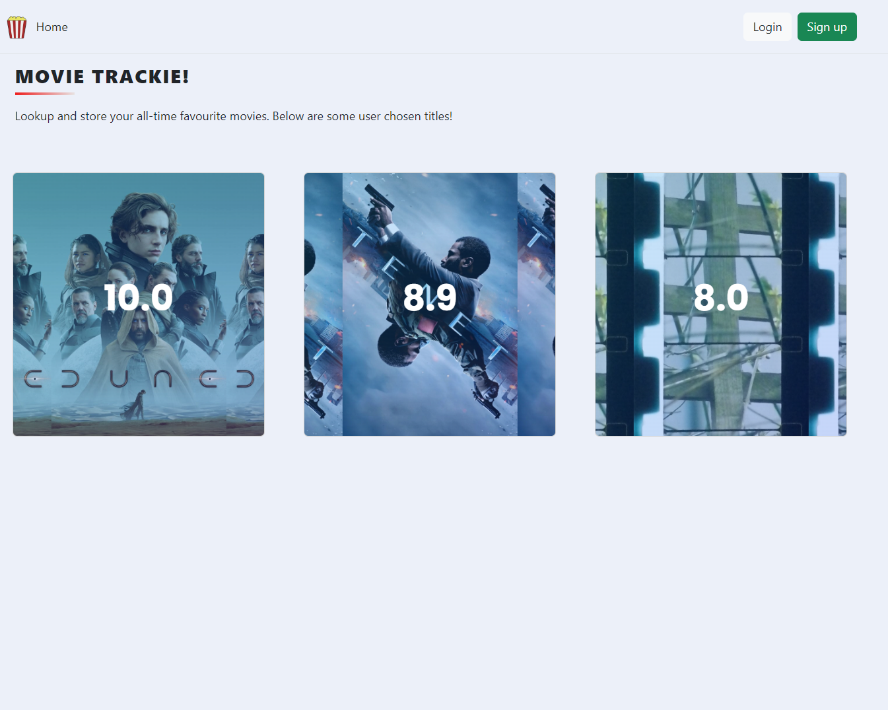
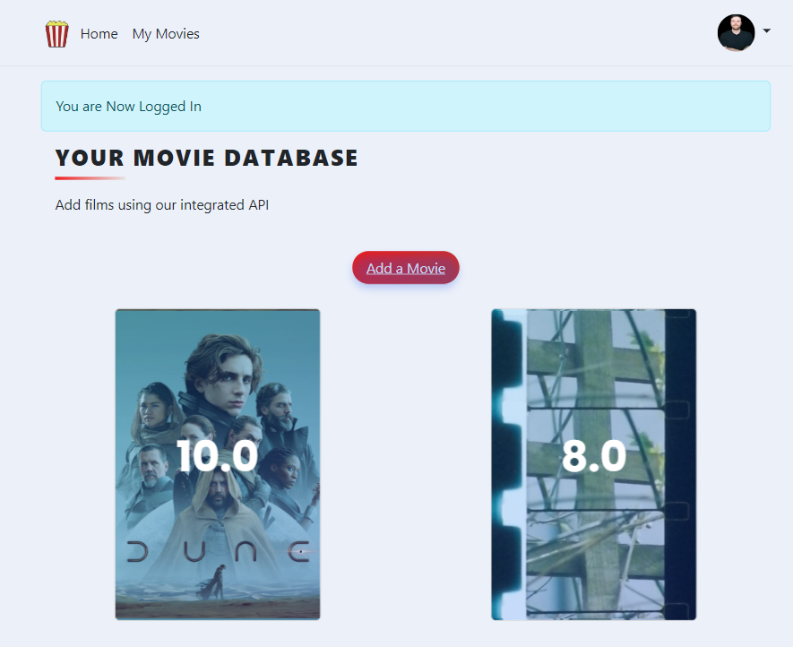
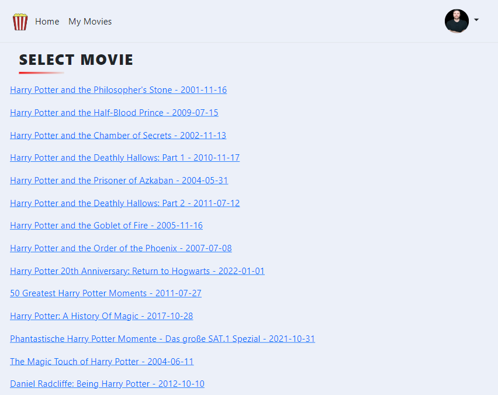
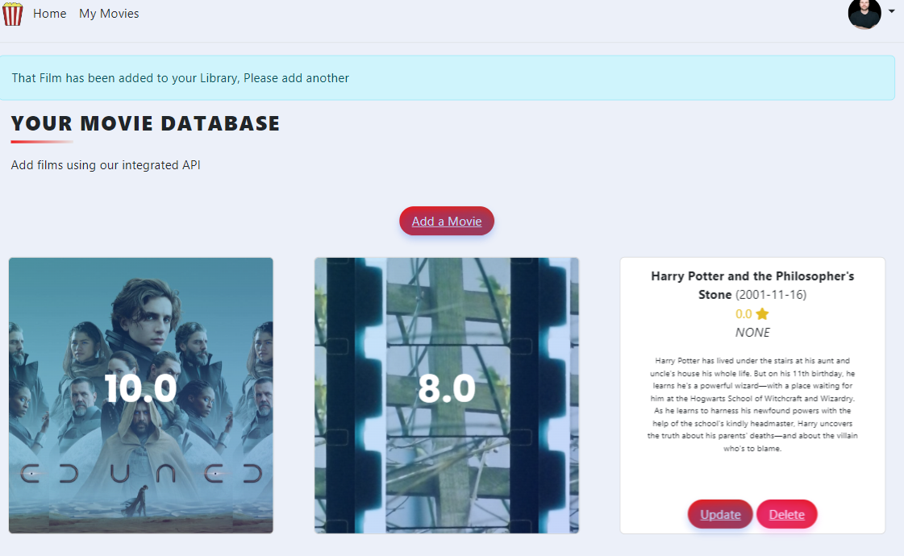

# Movie Library App
This App is hosted live at: https://movie-tracker-rhuj.onrender.com

## Description
This Movie Library App allows users to create and interact with a personalised movie collection. Users can search for movies using an API, adding them to their personalised library.

The App is coded using Python (Flask Framework), uses a SQL database (SQLAlchemy), Bootstrap 5 (CSS Framework) and utilises an in API  from https://www.themoviedb.org/

## Features
- Add new movies to the library (CRUD).
- User Registration and secure login, with customer avatar imaging. Utilisation of Bcrypt
- Search for movies in the collection seeking data form an external API.
- Flash messaging for a positive user experience.
- User-friendly interface for easy navigation using Bootstrap5.
- Object Oriented Programming used to create Database models and user input forms.

## Live Screen Shots

1. **Home Page**: Here you can see the Home page, featuring publicly displayed movie choices along with login and sign-up functionality.

    

2. **User Logged In**: After logging in, a flash message notifies the user. The user is granted additional functionality such as My Movies, Add a Movie, and a custom navigation bar avatar with options.

    

3. **API Search Result**: This image shows the result of an API call following a search for the movie "Harry Potter".

    

4. **User's Library**: The user's library is updated with the new movie. Data such as the movie cover image, title, and description are automatically populated. Each new entry allows for CRUD (Create, Read, Update, Delete) operations by the user.

    

5. **User's Profile Page**: Featuring the date of registration, username, and options to edit profile data.

    

## Installation
To install the Movie Library App, follow these steps:
1. Clone the repository: `git clone https://github.com/chapmanic/Movie-Library-App.git`
2. Install dependencies: pip install -r requirements.txt
3. Initialise the database: python init_db.py
4. Run the application: python main.py
** Remember to create a .env file to store your variables **   

## Contributing
Contributions to the Movie Library App are welcome. Please fork the repository, make your changes, and submit a pull request for review.

## License
This project is licensed under the [MIT License](LICENSE).

## Contact
For questions or suggestions, please contact aden@accessmycare.co.uk.
